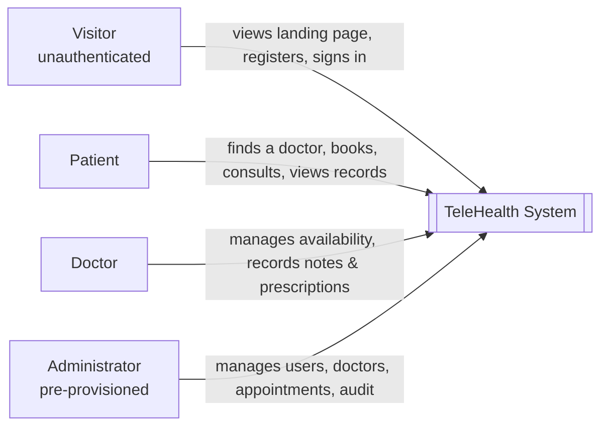

# C4 — Level 1: System Context

The TeleHealth system and the people who interact with it.

## Actors

- **Visitor** — unauthenticated person who lands on the public product website.
- **Patient** — registered user who books and attends consultations and reviews their records.
- **Doctor** — registered user who manages a professional profile, availability, and clinical notes.
- **Administrator** — pre-provisioned operator (no public registration) who oversees the platform.

## The system

A single standalone web application with a public landing page and role-based Patient, Doctor, and
Admin interfaces, backed by a NestJS API and PostgreSQL. The consultation workspace tracks session
state only — no audio/video streaming or external conferencing.
