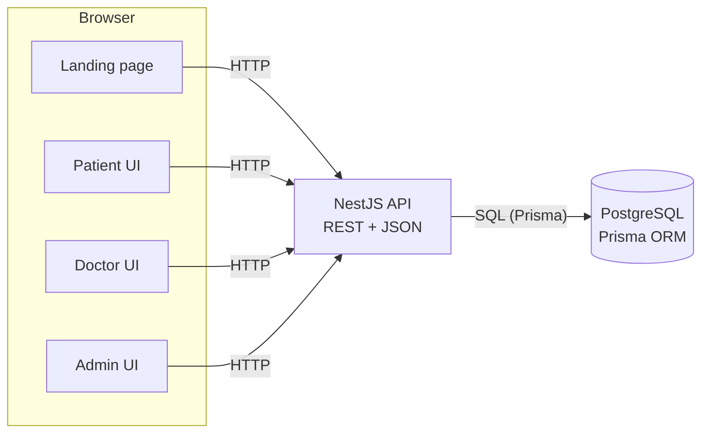

# C4 — Level 2: Containers

The deployable units of the system.

## Containers

| Container | Technology | Responsibility |
| --- | --- | --- |
| **Landing page** | Next.js | Public marketing page, registration/sign-in routes, trust/legal content. |
| **Patient UI** | Next.js (App Router) | Discovery, matching, booking, consultations, records. |
| **Doctor UI** | Next.js (App Router) | Profile, availability, appointments, consultation workspace. |
| **Admin UI** | Next.js (App Router) | User management, doctor review, oversight, dashboard, audit. |
| **API** | NestJS | All business logic, authentication, role-based authorization, deterministic matching, booking-conflict rules. |
| **Database** | PostgreSQL + Prisma | Accounts, profiles, availability, appointments, consultations, prescriptions, notifications, audit. |

The frontend is served by a single Next.js app; the role-based interfaces are route groups within it,
not separate deployments.
