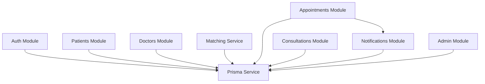

# C4 — Level 3: Components

The NestJS modules that make up the API.

## Modules

| Module | Capability | Responsibility |
| --- | --- | --- |
| **Auth** | `auth` | Register, sign-in, JWT issuance, role guards (`RolesGuard`), `@CurrentUser` decorator. |
| **Patients** | `patient-profile`, `medical-records` | Patient profile CRUD, appointment history, prescriptions. |
| **Doctors** | `doctor-profile`, `doctor-discovery` | Doctor profile, availability management, discovery/search. |
| **Matching** | `doctor-discovery` | Deterministic symptom → specialty matching (no external AI). |
| **Appointments** | `appointments` | Booking, rescheduling, cancellation; transactional slot-claim conflict rules. |
| **Consultations** | `consultations` | Session workspace, state transitions, notes, prescriptions. |
| **Notifications** | `notifications` | Database-backed in-app notifications + synthesized "upcoming". |
| **Admin** | `admin` | User management, doctor review, appointment oversight, dashboard, audit log. |
| **Prisma** | — | Single `PrismaService` (global module) wrapping the generated client. |

The `JwtModule` is registered globally; guards are applied per-controller with `@Roles(...)` metadata.
