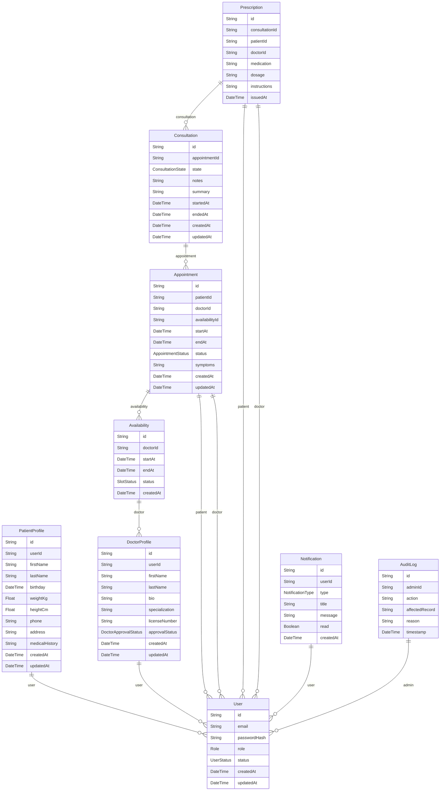

# Data model

The PostgreSQL schema is defined in `apps/api/prisma/schema.prisma` and accessed via Prisma ORM.

> This page is generated from the Prisma schema. Regenerate with `pnpm docs:generate`.

