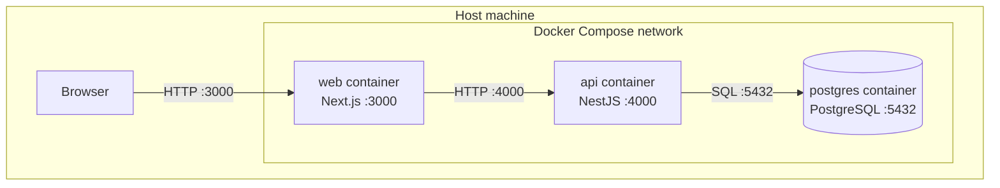

# C4 — Deployment

The standalone runtime via Docker Compose.

## Services

| Service | Image | Port | Notes |
| --- | --- | --- | --- |
| **web** | built from `apps/web/Dockerfile` | `3000` | Next.js production build (`next start`). `NEXT_PUBLIC_API_URL` is inlined at build time. |
| **api** | built from `apps/api/Dockerfile` | `4000` | On start: `prisma db push` → `prisma db seed` → `node dist/main.js`. Includes `openssl` for Prisma. |
| **postgres** | `postgres:16-alpine` | `5432` | Persisted via a named volume; health-checked with `pg_isready`. |

## Startup order

1. `postgres` starts and passes its health check.
2. `api` waits on `postgres`, applies the schema, seeds data, and serves.
3. `web` waits on `api` and serves the frontend.

Run everything with `docker compose up --build`.
