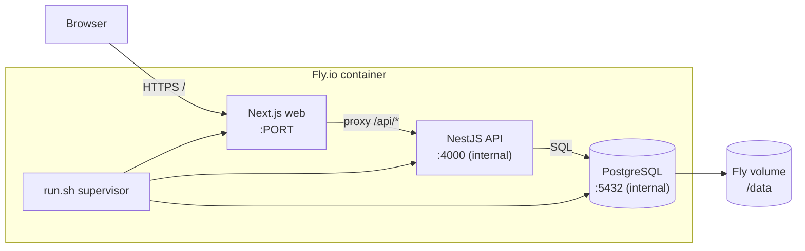

# Documentation

## Module overview

Introduces a single self-contained deployment target for the whole stack. `Dockerfile.fly` builds
one image containing PostgreSQL, the NestJS API, and the Next.js web app; `scripts/run.sh` is a
small supervisor that boots them in order. The web is the only public entry point — it proxies
`/api/*` to the internal API via a Next.js rewrite — and Postgres persists on a Fly volume. The
`fly-io-deployment` capability describes the deployment contract; no product modules change.

## Component diagram

## Data model

No new Prisma models. The deployment reuses the existing schema and, on first boot, runs the same
migrations/seed against a Postgres instance living inside the container and backed by a Fly volume.
