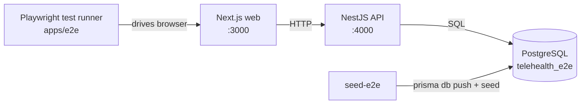

# Documentation

## Module overview

Introduces a new `e2e-testing` capability implemented as a standalone workspace package
(`apps/e2e`). It is not a runtime module — it drives the existing `web` and `api` containers
through a real browser using Playwright. It depends on an isolated seed (`seed-e2e`) and an E2E
Compose override so tests run against a throwaway `telehealth_e2e` database, never the developer's
data. It plugs into CI via `.github/workflows/e2e.yml`.

## Component diagram

## Data model

No new Prisma models are introduced. The tests reuse the existing schema and populate it with
dedicated fixture rows via `seed-e2e` (test-only accounts and availability). The production data
model is unchanged.
