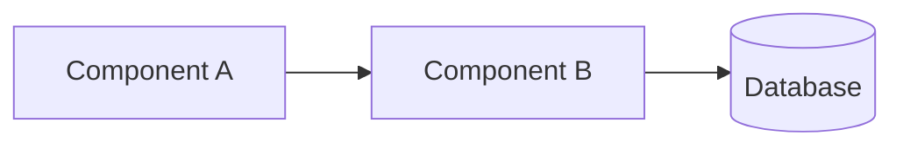
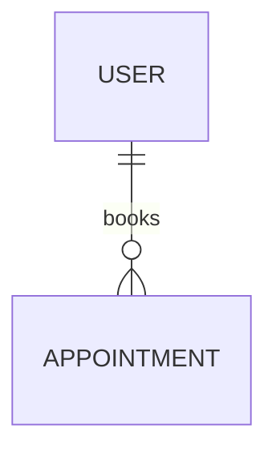

# Documentation

## Module overview

<!-- Which NestJS module(s) this change touches, and how they fit into the system.
     Reference existing capabilities by their openspec/specs/ path. -->

## Component diagram

<!-- Mermaid flowchart at C4 level 3 (components and their relationships).

If no component change, say so explicitly. -->

## Data model

<!-- Mermaid erDiagram of any Prisma models this change adds or modifies.

If no data model change, say so explicitly. -->
